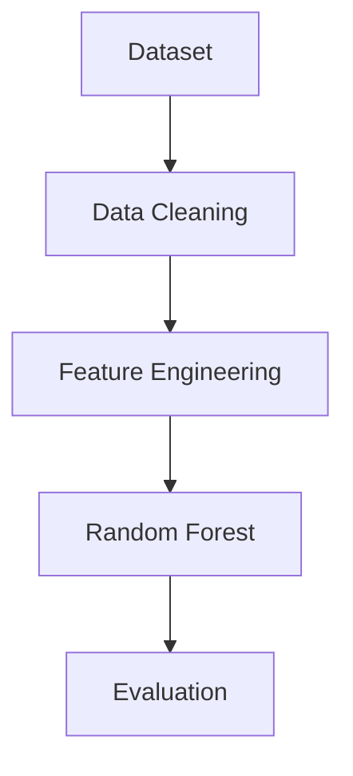

# 医疗大模型新人快速上手指南

> 面向零基础同学的医疗AI开发入门实践指南
> 基于「PDF文献智能解析项目」与「心力衰竭生存预测项目」实践经验总结

------

# 第一章 前言

## 1.1 为什么要学习医疗AI？

近年来，大模型（Large Language Model，LLM）技术迅速发展，从 ChatGPT、Claude 到 Gemini，AI 已经开始深刻改变科研、医疗和教育领域的工作方式。

在医疗领域，AI 可以帮助研究人员完成：

- 医学文献阅读与总结
- 医学知识检索
- 临床数据分析
- 医学图像辅助分析
- 科研论文写作
- 科研绘图与可视化

过去需要花费数天甚至数周完成的工作，现在借助AI工具，往往几个小时即可完成初稿。

因此，对于医学、生物信息学、计算机科学以及数据科学相关专业的学生而言，掌握医疗AI开发已经成为一项越来越重要的能力。

------

## 1.2 新人最容易遇到哪些问题？

很多同学刚接触医疗AI时会认为：

> 最难的是算法。

实际上并非如此。

根据个人学习经历和项目实践经验，真正让新人头疼的往往是：

- Python环境配置失败
- 不知道安装哪些库
- 不会调用大模型API
- 看不懂代码报错信息
- 不知道如何向AI提问
- 不知道如何阅读医学论文
- 不会绘制科研图表
- 不会撰写科研论文

这些问题看似零散，但几乎每位新手都会经历。

幸运的是，大多数问题都有成熟的解决方案。

------

## 1.3 本指南能够帮助你什么？

本指南结合本人完成的两个实践项目：

### 项目一：PDF医学文献智能解析系统

项目目标：

```text
上传PDF
    ↓
提取论文文本
    ↓
调用大模型分析
    ↓
提取医学实体
    ↓
输出结构化结果
```

项目涉及：

- Python开发
- PDF解析
- API调用
- Prompt工程
- 信息抽取

------

### 项目二：心力衰竭生存预测项目

项目目标：

```text
医疗数据集
    ↓
数据清洗
    ↓
随机森林建模
    ↓
模型评估
    ↓
LaTeX论文撰写
```

项目涉及：

- 数据分析
- 机器学习
- 科研绘图
- 论文写作

------

通过阅读本指南，你将了解：

✅ 如何快速搭建Python环境

✅ 如何调用大模型API

✅ 如何利用AI辅助编程

✅ 如何利用AI解决代码报错

✅ 如何利用AI阅读论文

✅ 如何利用AI绘制科研图表

✅ 如何利用AI辅助完成科研论文

------

# 第二章 工具篇

## 2.1 如何快速完成Python环境配置

### 什么是Python？

如果把医疗AI项目比作建造一栋房子：

- Python是施工工具；
- 第三方库是建筑材料；
- 代码是施工过程；
- 最终模型是建好的房子。

因此，学习医疗AI的第一步，就是配置Python开发环境。

------

### 为什么推荐Anaconda？

对于零基础同学，最推荐安装：

```text
Anaconda
```

很多新手喜欢直接安装Python。

但实际上这样做经常会遇到：

```text
库安装失败
环境冲突
版本不兼容
```

等问题。

Anaconda可以理解为：

> 已经帮你安装好常用工具的大礼包。

优点：

- 自带Python
- 自带Jupyter Notebook
- 自带常用科学计算库
- 方便管理项目环境
- 对新手非常友好

因此在学习阶段，优先推荐使用Anaconda。

------

### 如何验证安装成功？

安装完成后打开：

```text
CMD
PowerShell
Windows Terminal
```

输入：

```bash
python --version
```

如果看到类似结果：

```text
Python 3.11.9
```

说明Python已经安装成功。

还可以输入：

```bash
where python
```

查看当前系统正在使用哪个Python环境。

------

### VSCode如何配置Python解释器？

很多同学会遇到这样的问题：

```text
明明安装了Python
但是代码仍然无法运行
```

原因通常是：

```text
VSCode没有使用正确的Python环境
```

解决方法：

按下：

```text
Ctrl + Shift + P
```

输入：

```text
Python: Select Interpreter
```

选择：

```text
Anaconda Python
```

即可完成配置。

------

### 常用Python库安装

医疗AI项目最常见的库包括：

#### 数据分析

```bash
pip install pandas
pip install numpy
```

作用：

- 读取数据
- 清洗数据
- 数据统计分析

------

#### 数据可视化

```bash
pip install matplotlib
pip install seaborn
```

作用：

- 绘制统计图
- 绘制科研图表
- 结果可视化

------

#### 机器学习

```bash
pip install scikit-learn
```

作用：

- 随机森林
- 逻辑回归
- 支持向量机
- 数据预处理

------

#### 进阶模型

```bash
pip install xgboost
pip install lightgbm
```

作用：

- 梯度提升树模型
- 机器学习竞赛常用模型

------

## 2.2 国内如何无痛调用大模型API

### 什么是API？

很多同学会问：

> 平时直接打开ChatGPT聊天就可以了，为什么还要学习API？

区别如下：

```text
人类使用网页聊天
        ↓
程序使用API聊天
```

API可以理解为：

> 程序与大模型沟通的桥梁。

通过API，我们可以让程序自动完成任务。

例如：

```text
读取100篇论文
       ↓
自动总结
       ↓
自动提取信息
       ↓
生成报告
```

这些工作都需要API支持。

------

### 新人常见问题

第一次调用API时，很多同学会遇到：

```text
连接失败
超时
认证错误
无法访问
```

因此推荐优先使用国内兼容平台。

例如：

- SiliconFlow（硅基流动）
- DeepSeek API
- 阿里百炼
- 腾讯混元
- OpenRouter

这些平台通常：

- 国内访问稳定
- 支持OpenAI格式
- 价格较低
- 上手简单

------

### API调用流程

整个调用过程可以理解为：

```text
程序提问
    ↓
发送到大模型
    ↓
大模型思考
    ↓
返回答案
```

对应代码：

```python
from openai import OpenAI

client = OpenAI(
    api_key="YOUR_API_KEY",
    base_url="https://api.siliconflow.cn/v1"
)

response = client.chat.completions.create(
    model="deepseek-chat",
    messages=[
        {
            "role":"user",
            "content":"请总结这篇医学论文"
        }
    ]
)

print(response.choices[0].message.content)
```

------

## 2.3 如何利用AI辅助编程

很多新人都会纠结：

> ChatGPT、Claude、Gemini到底应该选哪个？

实际上并不存在绝对最好的工具。

关键在于任务匹配。

------

### ChatGPT：编程助手

适合：

- 代码生成
- Debug
- 算法解释
- 代码优化
- 科研绘图

例如：

```text
请使用随机森林模型预测心衰患者生存率，
并输出完整Python代码。
```

------

### Claude：论文阅读助手

适合：

- 阅读长篇论文
- 文献总结
- 项目规划
- 学术写作

例如：

```text
请总结这篇论文的：

研究背景
研究方法
实验结果
研究局限性
```

------

### Gemini：多模态助手

适合：

- 图片理解
- 图表分析
- 流程图检查
- 图片内容识别

例如：

```text
解释这张ROC曲线图。
```

------

### 推荐组合

个人项目实践中最常见的搭配：

```text
Claude
负责读论文

↓

ChatGPT
负责写代码

↓

Gemini
负责检查图片和图表
```

这种分工通常效率最高。

------

# 第三章 实战篇

## 3.1 为什么AI有时候帮不了你？

很多同学会说：

> 我已经把报错发给AI了，为什么还是解决不了？

原因通常不是AI能力不足。

而是：

```text
提供的信息太少
```

AI并不会自动知道：

- 你的代码是什么
- 你的数据是什么
- 你的运行环境是什么

因此提问方式非常重要。

------

## 3.2 AI Debug黄金公式

推荐牢记下面这个公式：

```text
代码
+
报错
+
环境
+
目标
=
高质量答案
```

也就是说：

不要只发一句：

```text
代码报错了，帮我看看。
```

而应该提供：

```text
我想完成什么任务

完整代码

完整报错

Python版本

运行环境
```

信息越完整，AI给出的答案通常越准确。

------

## 3.3 错误示范

```text
代码跑不起来

帮我改一下
```

这种提问方式的问题在于：

AI根本不知道：

- 哪段代码有问题
- 运行环境是什么
- 希望达到什么效果

因此回答往往不准确。

------

## 3.4 正确示范

```text
你是一名Python工程师。

任务：
训练随机森林模型。

运行环境：
Python 3.11

代码：
（完整代码）

报错：
（完整报错）

请：

1. 分析错误原因
2. 提供修改方案
3. 返回完整修复代码
```

这样的Prompt通常能够获得更高质量的答案。

------

## 3.5 实际案例：XGBoost安装失败

在项目开发过程中，曾出现：

```bash
pip install xgboost
```

安装失败的问题。

如果只是告诉AI：

```text
xgboost安装失败
```

基本得不到有效答案。

正确做法：

```text
系统：
Windows 11

Python：
Anaconda Python 3.11

命令：
pip install xgboost

报错：
（完整报错信息）
```

这样AI才能准确判断问题来源。

常见原因包括：

- pip版本过旧
- 网络问题
- 镜像源问题
- 环境变量问题

------

## 3.6 实际案例：随机森林项目调试

在心力衰竭预测项目中，曾出现：

```python
ValueError:
Input contains NaN
```

经过分析发现：

```text
数据集中存在缺失值
```

而随机森林无法直接处理缺失值。

解决方法：

```python
from sklearn.impute import SimpleImputer

imputer = SimpleImputer(strategy='median')

X = imputer.fit_transform(X)
```

问题成功解决。

这个案例告诉我们：

> 很多报错并不是模型的问题，而是数据的问题。

学会阅读报错信息，往往比盲目修改代码更加重要。

------

# 第四章 项目实践经验

## 4.1 项目一：PDF医学文献智能解析系统

在科研过程中，经常需要阅读大量医学论文。

传统方式：

```text
下载论文
↓
逐篇阅读
↓
手工整理
```

效率较低。

因此开发了PDF医学文献智能解析系统。4.1 项目一：PDF医学文献智能解析系统（续）

### 项目目标

该项目的核心目标是：

> 利用大模型自动阅读医学论文，并提取研究中的关键信息。

整个流程如下：

```text
上传PDF
    ↓
提取论文文本
    ↓
调用大模型分析
    ↓
提取关键实体
    ↓
输出结构化结果
```

相比于人工阅读论文，这种方式能够显著提高文献整理效率。

------

### 技术路线

项目采用如下技术方案：

```text
PDF文件
    ↓
PyMuPDF
    ↓
文本提取
    ↓
大模型API
    ↓
实体识别
    ↓
JSON结构化输出
```

其中：

#### PyMuPDF

作用：

```text
读取PDF
提取文本
获取页码信息
```

#### 大模型API

作用：

```text
理解论文内容
分析研究逻辑
提取关键信息
```

#### JSON输出

作用：

```text
方便后续存储
方便数据库管理
方便批量分析
```

------

### Prompt设计经验

很多新人容易忽略Prompt的重要性。

实际上：

> 相同的大模型，不同的Prompt，结果可能完全不同。

例如：

错误Prompt：

```text
帮我总结这篇论文。
```

结果往往比较宽泛。

推荐Prompt：

```text
请从以下医学论文中提取：

1. 疾病名称
2. 药物名称
3. 研究对象
4. 实验方法
5. 主要结论

并以JSON格式返回。
```

这样输出会更加稳定。

------

### 输出示例

```json
{
    "Disease":"Heart Failure",
    "Drug":"ACEI",
    "Population":"Heart Failure Patients",
    "Method":"Randomized Clinical Trial",
    "Conclusion":"ACEI significantly reduced mortality"
}
```

------

### 项目总结

通过该项目，我最大的收获并不是学会了调用API，而是理解了：

```text
AI ≠ 魔法

高质量输入
      ↓
高质量输出
```

很多时候，问题不在模型，而在于我们如何向模型表达需求。

------

## 4.2 项目二：心力衰竭生存预测研究

### 项目背景

心力衰竭（Heart Failure）是一种常见且危险的心血管疾病。

如果能够提前预测患者生存风险，就能够帮助医生进行更加精准的治疗决策。

因此，本项目利用机器学习方法建立预测模型。

------

### 项目整体流程

整个项目流程如下：

```text
数据获取
    ↓
数据清洗
    ↓
探索性分析
    ↓
类别不平衡分析
    ↓
训练集划分
    ↓
随机森林建模
    ↓
模型评估
    ↓
论文撰写
```

------

### 为什么数据清洗很重要？

很多新人认为：

```text
模型决定结果
```

实际上：

```text
数据质量决定模型上限
模型能力决定最终效果
```

在本项目中，大量时间花费在：

- 缺失值处理
- 异常值分析
- 数据分布检查
- 特征筛选

而不是模型训练本身。

------

### 为什么选择随机森林？

随机森林（Random Forest）具有以下优点：

- 易于理解
- 对数据要求较低
- 抗过拟合能力较强
- 适合中小规模医学数据集

对于初学者来说，是非常适合作为入门模型的选择。

------

### 常用评价指标

模型训练完成后，需要评估性能。

常见指标包括：

#### Accuracy（准确率）

表示：

```text
预测正确的比例
```

------

#### Precision（精确率）

表示：

```text
预测为阳性的人中
真正阳性的比例
```

------

#### Recall（召回率）

表示：

```text
所有真实阳性样本中
被正确识别出来的比例
```

------

#### F1-score

综合考虑：

```text
Precision
+
Recall
```

------

#### ROC-AUC

医学研究中最常用指标之一。

AUC越接近：

```text
1
```

说明模型区分能力越强。

------

### 项目总结

这个项目让我认识到：

> 机器学习项目中，80%的时间往往花在数据处理上，而不是模型训练上。

对于新人来说，先学会规范的数据分析流程，再追求复杂模型，会更加有效。

------

# 第五章 进阶篇

## 5.1 如何利用AI高效科研绘图

科研项目完成后，通常需要：

- 流程图
- 技术路线图
- 模型结构图
- 结果展示图

传统绘图方式往往比较耗时。

现在可以利用AI大幅提高效率。

------

### 推荐工具组合

```text
ChatGPT
+
Mermaid
+
Draw.io
+
Napkin AI
+
Gemini
```

各自作用：

| 工具      | 主要用途       |
| --------- | -------------- |
| ChatGPT   | 生成图表草稿   |
| Mermaid   | 绘制流程图     |
| Draw.io   | 精细化修改     |
| Napkin AI | 自动生成结构图 |
| Gemini    | 检查图片内容   |

------

### 流程图生成案例

例如：

在心衰预测项目中，可以直接输入：

```text
请生成心力衰竭生存预测流程图。

步骤包括：

Dataset
Data Cleaning
Feature Engineering
Train/Test Split
Random Forest
Evaluation

要求：
全部英文标注
适合论文插图
具有科技感
```

即可快速获得流程图草稿。

------

### Mermaid示例

~~~markdown

~~~

这种方式非常适合课程论文和项目汇报。

------

## 5.2 如何缓解AI生图幻觉问题

### 什么是AI幻觉？

AI生成图片时，可能出现：

```text
拼写错误
箭头错误
逻辑错误
结构错误
```

尤其是在医疗领域更加常见。

例如：

- 器官位置错误
- 医学概念错误
- 流程顺序错误

------

### 方法一：明确约束条件

不要这样描述：

```text
画一个医疗AI流程图
```

而应该这样描述：

```text
画一个心衰预测流程图

步骤：

Dataset
Data Cleaning
Feature Selection
Random Forest
ROC Evaluation

全部使用英文
箭头从上到下
适合SCI论文
```

约束越明确，结果越可靠。

------

### 方法二：分步骤生成

不要一次要求：

```text
生成完整科研图
```

推荐：

```text
第一步：
生成框架

第二步：
增加图标

第三步：
优化布局

第四步：
调整配色
```

这样更容易控制质量。

------

### 方法三：让AI自检

生成图片后，可以继续提问：

```text
请检查该图是否存在：

1. 拼写错误
2. 流程错误
3. 医学概念错误
4. 箭头方向错误
```

能够有效减少幻觉问题。

------

# 第六章 科研写作经验

## 6.1 为什么要学习LaTeX？

很多新人刚接触论文时会问：

> 为什么不用Word？

实际上：

Word适合写作。

LaTeX更适合科研论文排版。

优点：

- 自动编号
- 自动引用
- 自动生成目录
- 数学公式支持优秀
- 期刊接受度高

因此建议尽早接触LaTeX。

------

## 6.2 AI辅助论文写作流程

推荐流程：

```text
实验完成
    ↓
结果分析
    ↓
图表生成
    ↓
论文初稿
    ↓
LaTeX排版
    ↓
修改润色
```

------

### 论文标准结构

```text
Title

Abstract

Introduction

Methods

Results

Discussion

Conclusion

References
```

几乎所有医学论文都遵循这一结构。

------

### AI写作Prompt示例

```text
请按照SCI医学论文格式撰写：

研究主题：
心力衰竭生存预测

模型：
Random Forest

要求：

包含：
Abstract
Introduction
Methods
Results
Discussion
Conclusion
References

使用学术写作风格。
```

------

### AI写论文时需要注意什么？

AI可以帮助：

- 生成初稿
- 优化表达
- 修改语法
- 完善结构

但不能代替研究者完成：

- 数据分析
- 结果解释
- 学术判断

因此：

> AI负责提高效率，研究者负责保证质量。

------

# 第七章 新人学习路线建议

很多同学都会问：

> 我应该先学什么？

推荐路线如下：

### 第一阶段：工具入门

学习内容：

```text
Python基础
Git基础
Markdown基础
VSCode使用
```

目标：

```text
能够运行代码
能够管理项目
```

------

### 第二阶段：数据分析

学习内容：

```text
NumPy
Pandas
Matplotlib
Seaborn
```

目标：

```text
能够读取数据
能够绘制图表
```

------

### 第三阶段：机器学习

学习内容：

```text
Scikit-Learn
随机森林
逻辑回归
XGBoost
```

目标：

```text
能够独立训练模型
```

------

### 第四阶段：大模型应用

学习内容：

```text
Prompt工程
API调用
RAG
Agent
```

目标：

```text
能够开发AI应用
```

------

### 第五阶段：科研实践

学习内容：

```text
论文阅读
科研绘图
论文写作
```

目标：

```text
完成完整科研项目
```

------

# 第八章 总结

对于新人来说，最重要的目标并不是训练出最复杂的模型，也不是使用最新的大模型。

真正重要的是完成一次完整的科研实践闭环：

```text
提出问题
    ↓
获取数据
    ↓
数据处理
    ↓
模型训练
    ↓
结果分析
    ↓
论文撰写
```

当你能够独立完成这一流程时，就已经具备了开展医疗AI项目研究的基础能力。

回顾本指南中的两个实践项目：

- PDF医学文献智能解析系统
- 心力衰竭生存预测项目

它们虽然技术难度不同，但都遵循同样的核心思想：

```text
发现问题
    ↓
分析问题
    ↓
利用AI提升效率
    ↓
完成项目目标
```

最后，希望每一位刚接触医疗AI的同学都能够记住：

> AI不会替代研究者，但善于使用AI的研究者，将拥有更高的学习效率、更强的科研能力以及更广阔的发展空间。

愿你能够从第一个成功运行的Python脚本开始，逐步完成属于自己的第一个医疗AI项目。